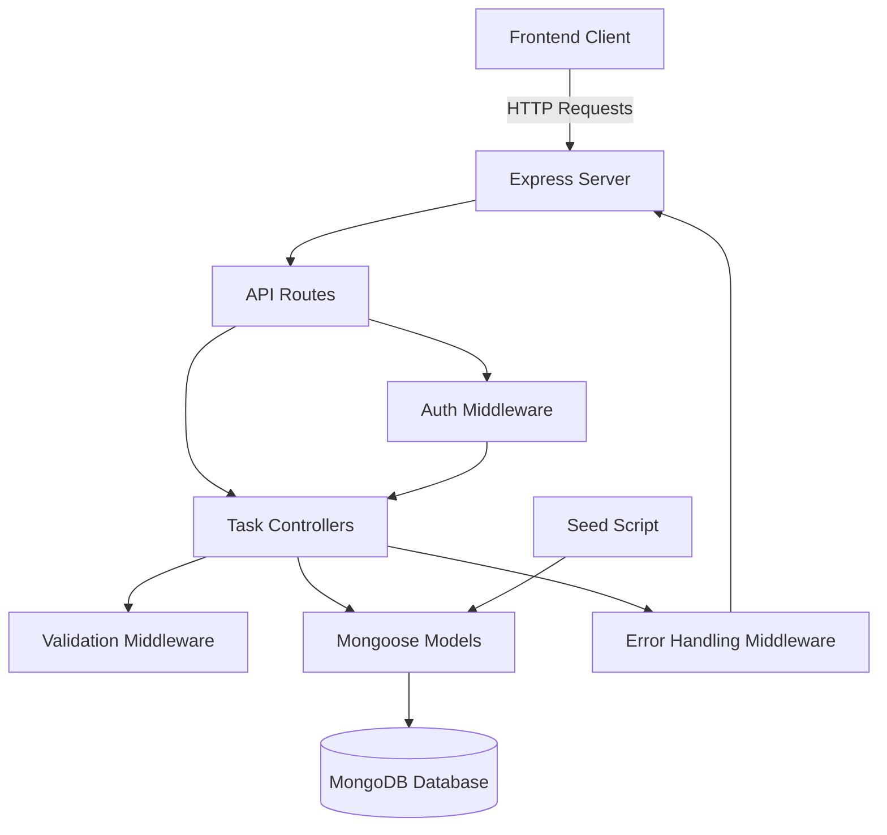
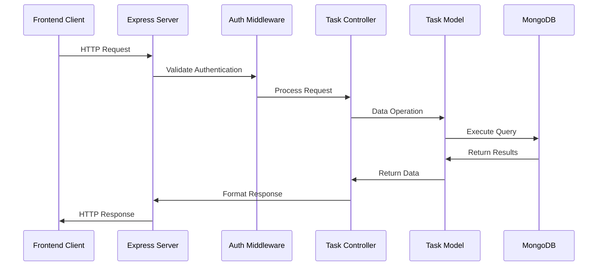
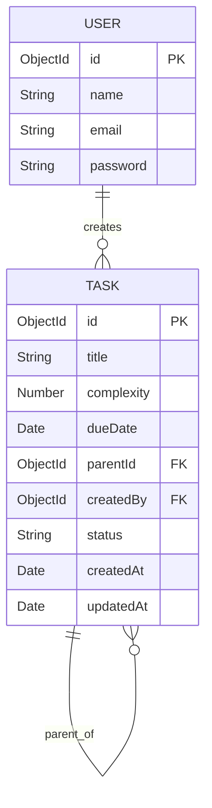
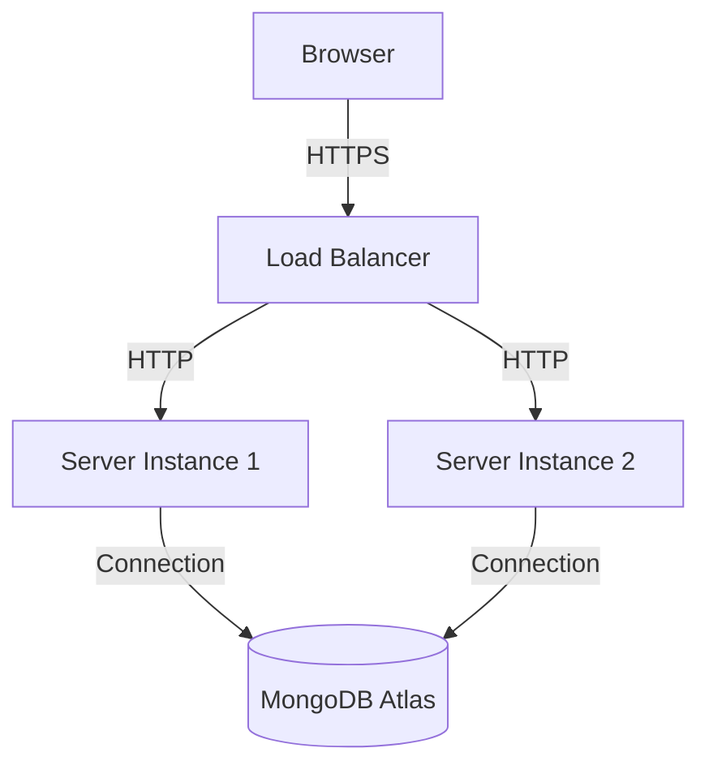

# Task Planner Backend Architecture

This document provides an overview of the Task Planner backend architecture, including component structure and data flow.

## System Architecture

## Component Details

### API Routes
- **Purpose**: Define the API endpoints and route requests to appropriate controllers
- **File Location**: `/routes/taskRoutes.js`

### Controllers
- **Purpose**: Handle business logic, process requests, and return responses
- **File Location**: `/controllers/taskController.js`
- **Key Functions**: 
  - `getAllTasks`
  - `getTaskById` 
  - `createTask`
  - `updateTask`
  - `deleteTask`

### Models
- **Purpose**: Define data schemas and database interaction
- **File Location**: `/models/Task.js`
- **Schema**: 
  - `title` - String (required)
  - `complexity` - Number (1-8)
  - `dueDate` - Date
  - `parentId` - ObjectId reference

### Middleware
- **Purpose**: Handle validation, authentication, and error processing
- **File Locations**: 
  - `/middleware/validation.js`
  - `/middleware/auth.js`
  - `/middleware/errorHandler.js`

## Data Flow

## Database Design

## Environment Configuration

The backend requires the following environment variables:
- `PORT` - Server port (default: 5000)
- `MONGO_URI` - MongoDB connection string
- `NODE_ENV` - Environment (development, production)
- `CORS_ORIGIN` - CORS allowed origin

## Deployment Architecture

This architecture document provides a high-level overview of the Task Planner backend system. For more detailed implementation information, refer to the codebase and inline documentation. 