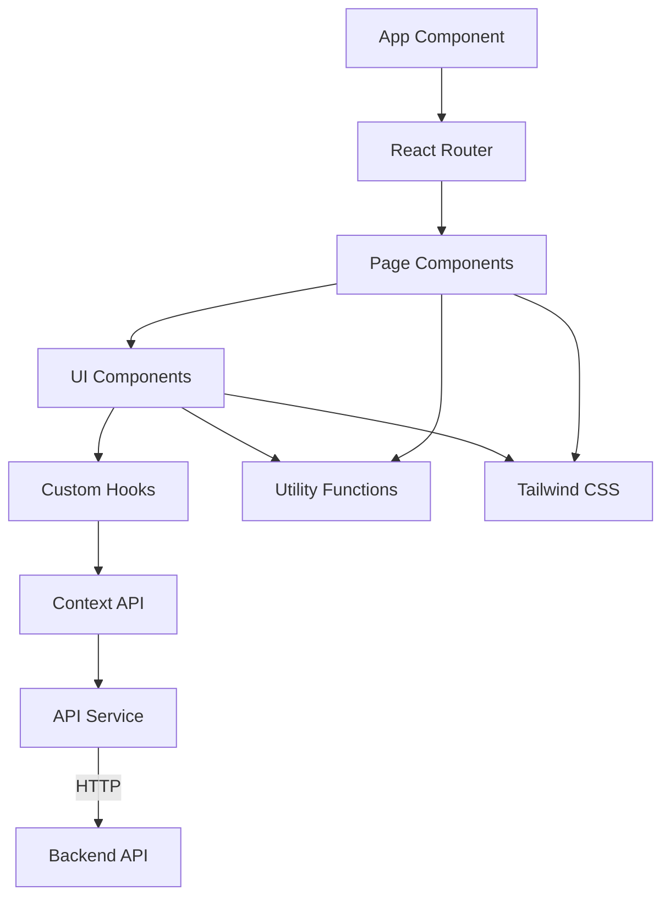
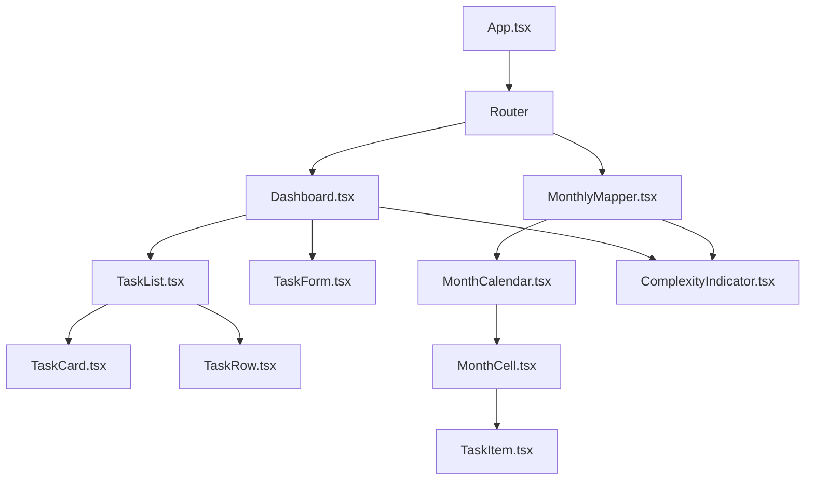
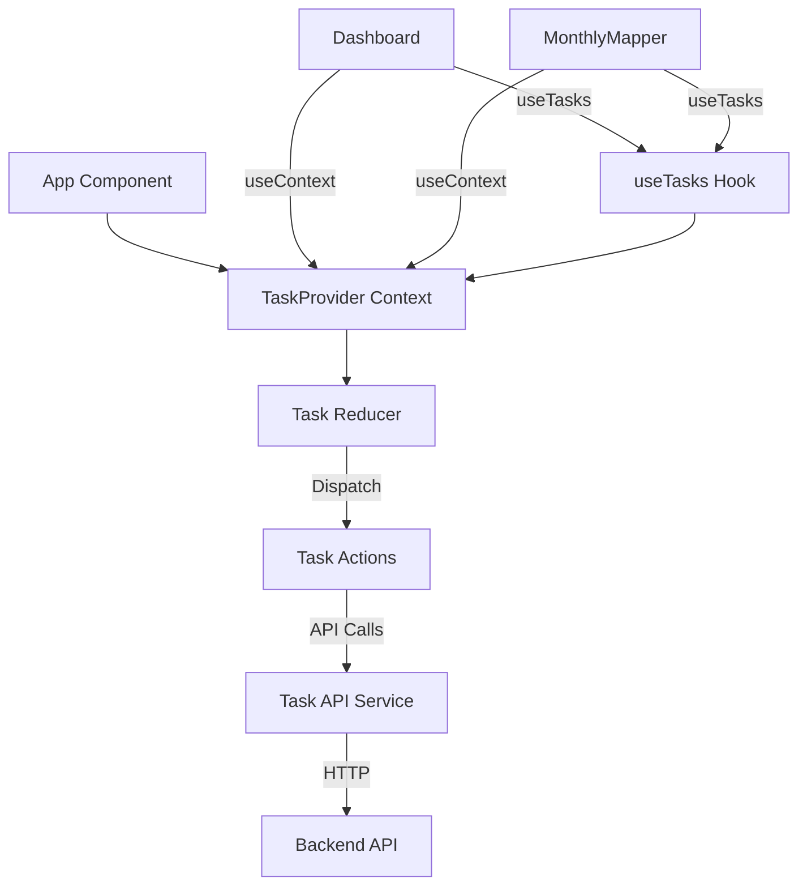
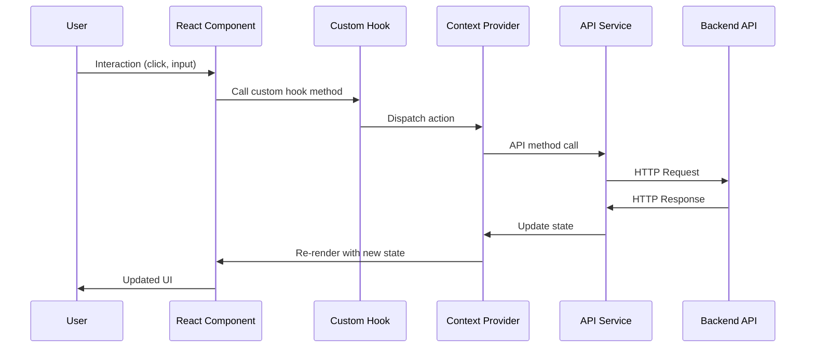
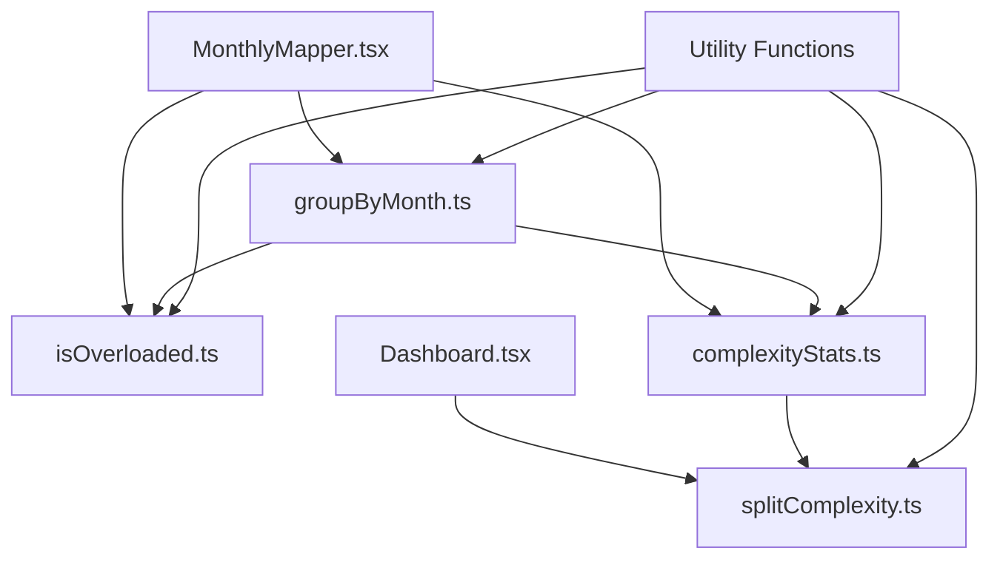
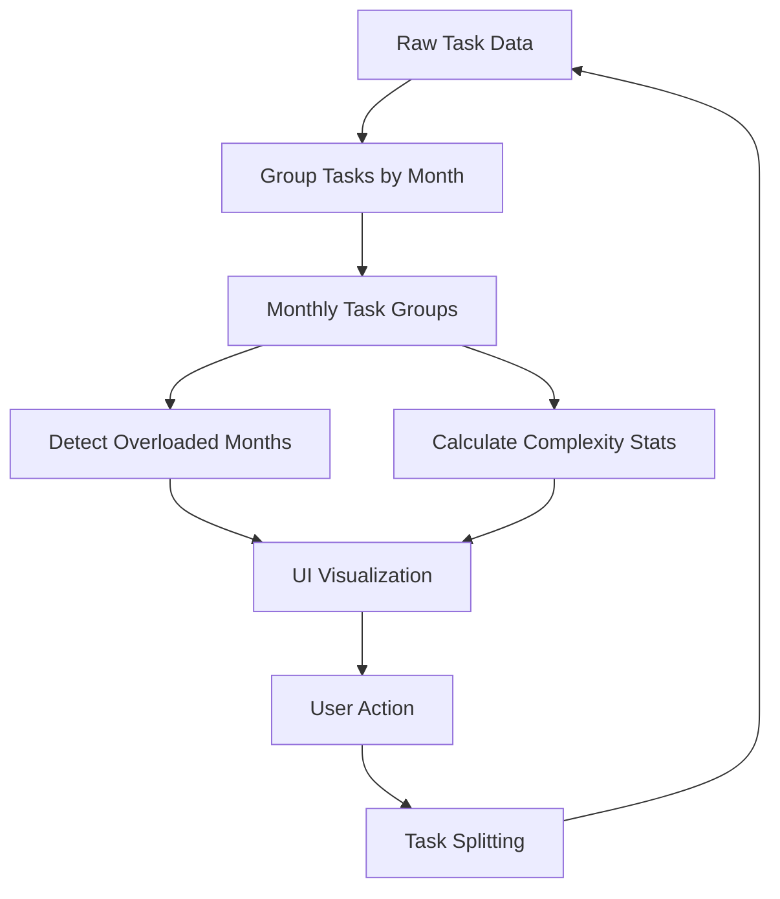
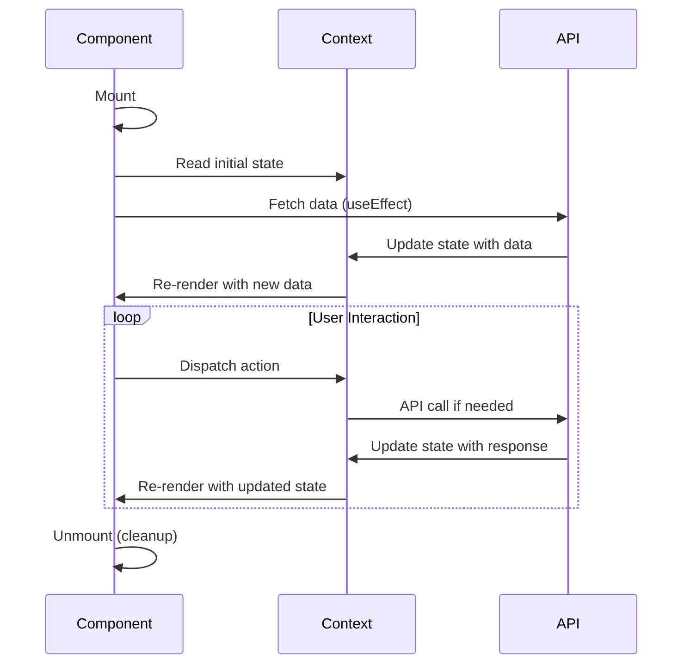
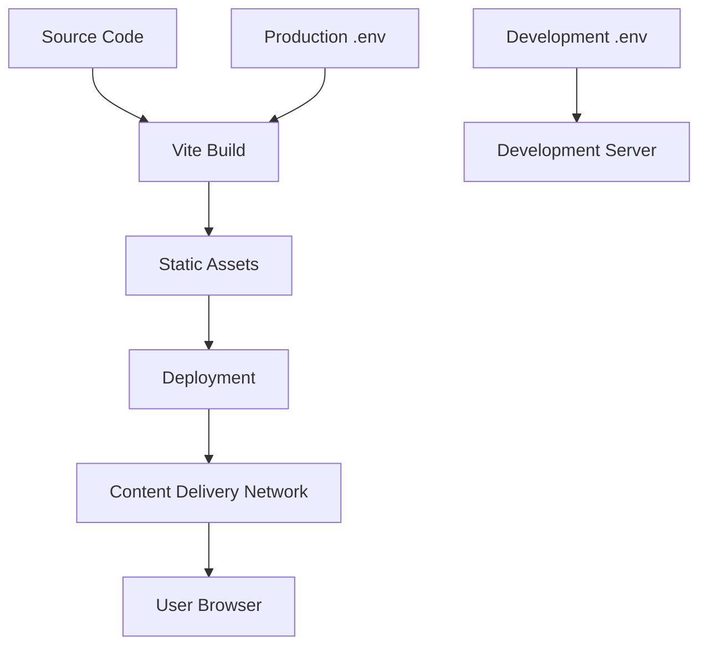

# Task Planner Frontend Architecture

This document provides an overview of the Task Planner frontend architecture, including component structure, state management, and data flow.

## System Architecture

## Component Structure

## State Management

## Data Flow

## Utility Functions

## Task Analysis Flow

## Component Lifecycle

## Environment Configuration

The frontend requires the following environment variables:
- `VITE_API_URL` - Backend API URL

## Build and Deployment Flow

This architecture document provides a high-level overview of the Task Planner frontend system. For more detailed implementation information, refer to the codebase and inline documentation. 