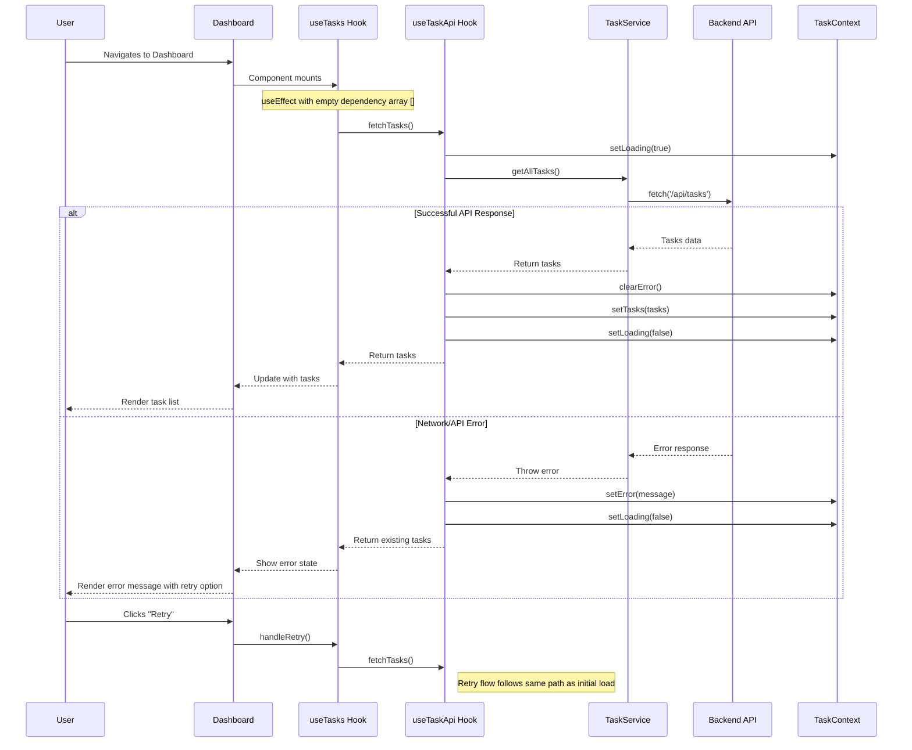
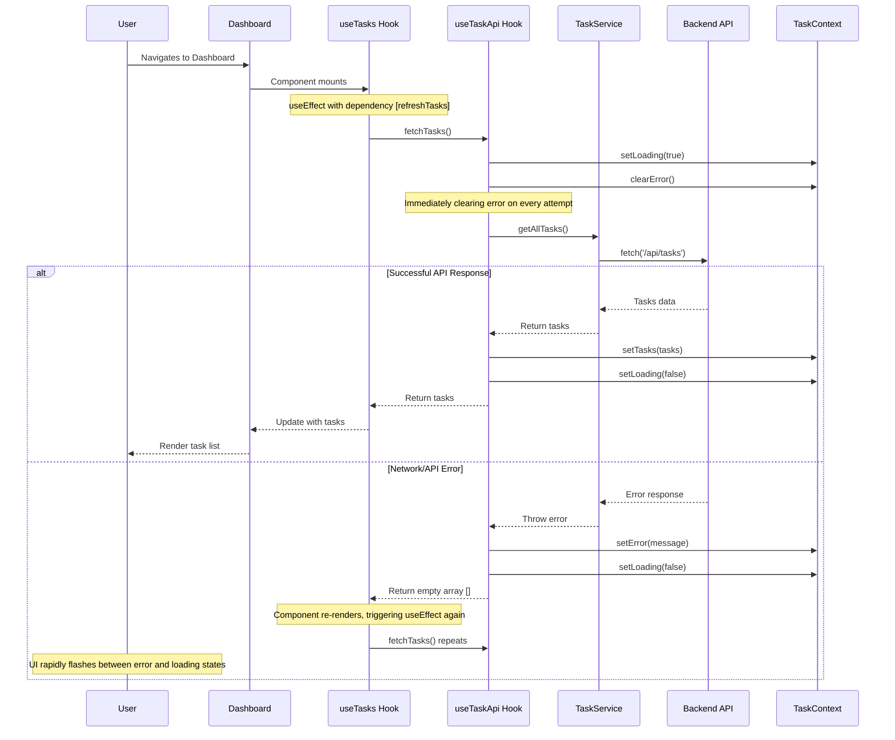

# Task Planner UI Sequence Diagram

## Fixed Data Loading Flow

## Problem: Previous Flow (Flashing Issue)

## Key Improvements

1. **One-time loading**: Using an empty dependency array `[]` in the `useEffect` hook ensures data is fetched only once when the component mounts.

2. **Persistent error handling**: Only clearing error state on successful responses, not at the start of fetch attempts.

3. **Return existing data on error**: Returning current state instead of empty arrays when errors occur prevents UI from wiping existing data.

4. **Manual retry flow**: Adding a dedicated retry button that users must explicitly click to attempt refetching data.

5. **Better error messages**: Improved network error handling with clear user-friendly messages.

6. **Proper API URL**: Setting the correct API base URL to ensure connections can be established. 